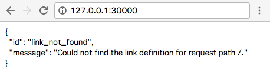

# Geister Web API Server

今回制作するガイスターで使用するゲームサーバは手元（開発者自身のPC上）に立てて、開発を行う。

## VirtualBox

* https://www.virtualbox.org/

### VirtualBoxとは
* コンピュータ内に仮想的なコンピュータを構築することができるソフトウェア
* 今回は Windows PC 上に Linux の環境を構築する

### VirtualBox導入方法
1. [ここ](https://www.virtualbox.org/wiki/Downloads) から、"VirtualBox platform packages" の Windows hosts (Windows用インストーラ)をダウンロード
2. ダウンロードしたインストーラを起動してインストール
3. NAS (`\\osaka-nas\osaka_intern`) に接続し、`Geister` フォルダから `geister.ova` (VirtualBoxの仮想アプライアンス)を取得する
4. VirtualBoxを起動する
5. メニューから仮想アプライアンスのインポートを選択する
6. 3. でダウンロードした `geister.ova` ファイルを選択して次へ
7. “すべてのネットワークカードのMACアドレスを再初期化”にチェックを入れて次へ
8. 仮想マシンが追加されるのでメニューから起動する
9. 起動時にネットワークを設定するように警告が出た場合はネットワーク設定ウィンドウを開きそのままOKを押す

#### 参考URL
* http://www.maruweb.jp.net/wp/?p=2040

## SSH クライアント

* https://osdn.jp/projects/ttssh2/

### SSHクライアントとは
* 他のコンピュータを遠隔操作する通信を行うツール
* 今回は先ほど VirtualBox で構築した仮想的なコンピュータを操作するために使用する

### 導入方法
* [ここ](https://osdn.jp/projects/ttssh2/) から最新バージョンをインストーラをダウンロード
* 標準インストールモードでインストール

### Tera Termから仮想マシンに接続する
1. VirtualBoxから仮想マシンを起動する
2. Tera Termを起動する
3. ホストに `127.0.0.1` 、TCPポートに `2222` を入力して OK をクリック
4. ユーザー名 `geister` とパスワード `geister` を入力し、更に「プレインパスワードを使う」を選択してOKを押し、サーバにログインする

### 以降は完成品のrubyサーバーを立てる手順です。
* サーバーインターンの方は[チュートリアルページ](server_intern_tutorial)を参照してサーバーを立ててください

1. ログインに成功したら以下のコマンドを実行し、作業フォルダに移動する。
  * `cd /home/geister/intern-geister/server`
2. 続いて以下のコマンドを実行し、サーバを起動する。
  * `rails server -b 0.0.0.0`
3. Windows側でブラウザを開き [http://127.0.0.1:3000/](http://127.0.0.1:3000/) にアクセスできるか確認する

### 成功時の画面


## mockの起動

### mock とは
* デバッグ用の機能で、サーバにリクエストを送ると、ダミーのレスポンス（決まった値）のみを返却するサーバになります
* アカウントを作ったり対戦相手を用意しなくても通信ができているかのチェックができるので便利！

### 起動手順
1. 上記の1〜5まで同じでサーバを起動する
2. 以下のコマンドを実行する
  * `specup schema.json --port 3000`
3. Windows側でブラウザを開き127.0.0.1:3000にアクセス出来るか確認する

## データベースのリセット方法

* サーバを停止した状態で以下のコマンドを実行する

```sh
DISABLE_DATABASE_ENVIRONMENT_CHECK=1 rake db:reset
```


## ドキュメント

* [ここから](../../server/schema.md)